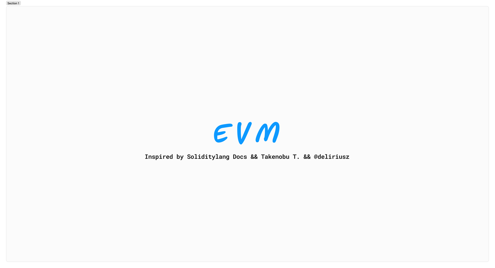

# Fundamentals of EVM

This repository is dedicated to exploring the **fundamentals of the Ethereum Virtual Machine (EVM)**.

## About the Repository

- Here, you will find an overview of what the **EVM world** entails, including its **structure**, **architecture**, and other components of the Ethereum Virtual Machine.
- The repository is intended for **educational purposes only** and will be updated periodically with new features and insights. Be sure to **follow** to stay updated!

## Figma Prototype

You can view the prototype of the EVM in **Figma**:

### [@> Click here to view the prototype](https://www.figma.com/board/EG6IMzdZz5FbfnN8VQzosP/EVM?node-id=0-1&p=f&t=LXmNEKaRzceXCJSJ-0)

## Inspired

- by [Soliditylang Docs](https://docs.soliditylang.org/en/v0.8.28/) && [Takenobu T.](https://takenobu-hs.github.io/downloads/ethereum_evm_illustrated.pdf) && [@deliriusz](https://www.youtube.com/@deliriusz)

# Asstes

| Item                 | Date          | Report                                         | Type |      |
| -------------------- | ------------- | ---------------------------------------------- | ---- | ---- |
| EVM All in One Image | Jan 2025      | [:page_facing_up:](img_src/EVM-All-in-One.png) | .png |   |
| EVM All in One PDF   | December 2024 | [:page_facing_up:](pdf_src/EVM.pdf)            | .pdf |   |

 

# EVM by Image

.png>)
.png>)
.png>)
.png>)
.png>)
.png>)
.png>)
.png>)
